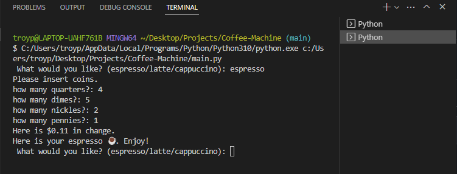

# Coffee-Machine
This is a mini website that has been developed using HTML, CSS and JavaScript. The site is designed to showcase the agency and its services, and to provide users with an easy and intuitive way to learn more about the agency and its services. The site has a simple and clean design, and it is fully responsive, making it accessible from any device. 

## How to use
You can use this code as a starting point to develop your own mini agency website. You can clone or download the repository and modify the code as per your requirements. You can add your own content, images and colors to make the site look unique and personalized.

## Technologies used
* Python

## Installation
1. Clone the repository using the following command:

``` bash
https://github.com/TEkdahl92/Coffee-Machine.git
```
2. Open the project folder in your code editor.

3. Run the program and answer the questions

## Preview
